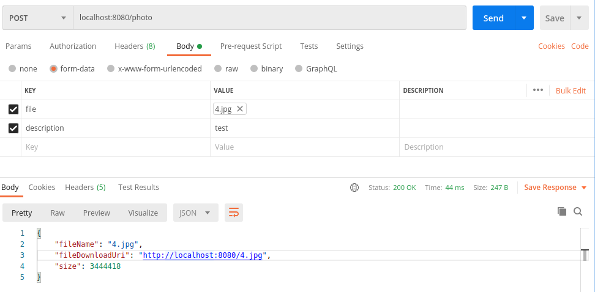

# Hướng dẫn Upload binary file lên REST

## 1. Cấu hình pom.xml
Chỉ cần spring-boot-starter-web là đủ. Ngoài ra lombok và spring-boot-starter-log4j2 để logging.

```xml
<dependency>
  <groupId>org.springframework.boot</groupId>
  <artifactId>spring-boot-starter-web</artifactId>
  <exclusions>
    <exclusion>
      <groupId>org.springframework.boot</groupId>
      <artifactId>spring-boot-starter-logging</artifactId>
    </exclusion>
  </exclusions>
</dependency>
<dependency>
  <groupId>org.springframework.boot</groupId>
  <artifactId>spring-boot-starter-log4j2</artifactId>
</dependency>
<dependency>
  <groupId>org.projectlombok</groupId>
  <artifactId>lombok</artifactId>
  <optional>true</optional>
</dependency>
<dependency>
  <groupId>org.springframework.boot</groupId>
  <artifactId>spring-boot-starter-data-jpa</artifactId>
</dependency>
```

## 2. Cấu hình trong application.properties
```
# Enable multipart uploads
spring.servlet.multipart.enabled=true
# Threshold after which files are written to disk.
spring.servlet.multipart.file-size-threshold=2KB
# Max file size.
spring.servlet.multipart.max-file-size=200MB
# Max Request Size
spring.servlet.multipart.max-request-size=215MB
```
```
Configure for database to store document data
spring.datasource.url=jdbc:h2:mem:test
spring.datasource.driverClassName=org.h2.Driver
spring.datasource.username=
spring.datasource.password=
spring.jpa.database-platform=org.hibernate.dialect.H2Dialect
spring.h2.console.enabled=true
spring.jpa.show-sql=false
spring.jpa.properties.hibernate.format_sql=false
```

## 3. Service xử lý việc lưu và get file
```java
@Transactional(rollbackOn = Exception.class) <-- Rollback when storing documents to directory or storing object to databse get error
public String storeFile(MultipartFile file, String description) {

    // Normalize file name
    String fileName = StringUtils.cleanPath(Objects.requireNonNull(file.getOriginalFilename()));

    try {
        // Check if the file's name contains invalid characters
        if (fileName.contains("..")) {
            throw new DocumentStorageException("Sorry! Filename contains invalid path sequence " + fileName);
        }

        // Copy file to the target location (Replacing existing file with the same name)
        Path targetLocation = this.fileStorageLocation.resolve(fileName);
        Files.copy(file.getInputStream(), targetLocation, StandardCopyOption.REPLACE_EXISTING);

        DocumentStorage doc = docStorageRepo.findDocumentStorageByName(fileName);
        if (doc != null) {
            doc.setFormat(file.getContentType());
            doc.setName(fileName);
            doc.setDescription(description);
            docStorageRepo.save(doc);
        } else {
            DocumentStorage newDoc = new DocumentStorage();
            newDoc.setDescription(description);
            newDoc.setFormat(file.getContentType());
            newDoc.setName(fileName);
            newDoc.setLink(ServletUriComponentsBuilder.fromCurrentContextPath().path(fileName).toUriString());
            docStorageRepo.save(newDoc);
        }

        log.info("fileName: " + fileName);
        log.info("contentType: " + file.getContentType());
        log.info("size: " + file.getSize());
        log.info("description: " + description);

        return fileName;
    } catch (IOException ex) {
        throw new DocumentStorageException("Could not store file " + fileName + ". Please try again!", ex);
    }
}


public Resource loadFileAsResource(String fileName) throws Exception {

    try {
        Path filePath = this.fileStorageLocation.resolve(fileName).normalize();
        Resource resource = new UrlResource(filePath.toUri());
        if (resource.exists()) {
            return resource;
        } else {
            throw new FileNotFoundException("File not found " + fileName);
        }
    } catch (MalformedURLException ex) {
        throw new FileNotFoundException("File not found " + fileName);
    }
}
```
## 4. Tạo phương thức POST hỗ trợ paramter dạng multipart
```java
@RequestParam("file") MultipartFile file, // Param "file" accept a binary file
@RequestParam("description") String description // Param "description" - description for the uploaded document
```
```java
public class DocumentController {

    @Autowired
    private DocumentStorageService documneStorageService;

    @PostMapping("/photo")
    public ResponseEntity<UploadDocumentResponse> uploadFile(@RequestParam("file") MultipartFile file, @RequestParam String description) {
        if (file == null) {
            throw new DocumentStorageException("You must select the a file for uploading", HttpStatus.BAD_REQUEST);
        }
        String fileName = documneStorageService.storeFile(file, description);
        String fileDownloadUri = ServletUriComponentsBuilder.fromCurrentContextPath().path(fileName).toUriString();
        return ResponseEntity.ok().body(new UploadDocumentResponse(fileName, fileDownloadUri, file.getSize()));

    }

    @GetMapping("/photo/{fileName}")
    public ResponseEntity<Resource> downloadFile(@PathVariable("fileName") String fileName) {

        Resource resource = null;
        if(fileName !=null && !fileName.isEmpty()) {
            try {
                resource = documneStorageService.loadFileAsResource(fileName);
            } catch (Exception e) {
                e.printStackTrace();
            }
            return ResponseEntity.ok()
                    .header(HttpHeaders.CONTENT_DISPOSITION, "attachment; filename=\"" + resource.getFilename() + "\"")
                    .body(resource);
        } else {
            return ResponseEntity.notFound().build();
        }
    }

    @GetMapping("/photo")
    public ResponseEntity<List<DocumentStorage>> getAll(){
        try{
            List<DocumentStorage> documentStorages = documneStorageService.getAll();
            return ResponseEntity.ok().body(documentStorages);
        } catch (Exception ex){
            return ResponseEntity.notFound().build();
        }
    }
```

## 5. Upload thử bằng Postman

- size is the document size got uploaded
- fileDownloadUri is the link to get to uploaded file